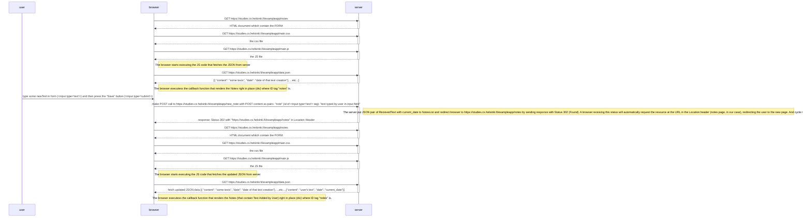

```mermaid
sequenceDiagram
    participant user
    participant browser
    participant server

    browser->>server: GET https://studies.cs.helsinki.fi/exampleapp/notes
    activate server
    server-->>browser: HTML document whitch contain the FORM
    deactivate server

    browser->>server: GET https://studies.cs.helsinki.fi/exampleapp/main.css
    activate server
    server-->>browser: the css file
    deactivate server

    browser->>server: GET https://studies.cs.helsinki.fi/exampleapp/main.js
    activate server
    server-->>browser: the JS file
    deactivate server

Note right of browser: The browser starts executing the JS code that fetches the JSON from server

    browser->>server: GET https://studies.cs.helsinki.fi/exampleapp/data.json
    activate server
    server-->>browser: [{ "content": "some texts", "date": "date of that text creation"}, ...etc...]
    deactivate server

Note right of browser: The browser executess the callback function that renders the Notes right in place (div) where ID tag "notes" is.

    user->>browser: type some newText in form (<input type="text">) and then press the "Save" button (<input type="submit">)
    browser->>server: make POST call to https://studies.cs.helsinki.fi/exampleapp/new_note with POST content as pairs: "note" (id of <input type="text"> tag): "text typed by user in input field"
activate server
Note right of server: The server put JSON pair of RecievedText with current_date to NotesList and redirect browser to https://studies.cs.helsinki.fi/exampleapp/notes by sending responce with Status 302 (Found). A browser receiving this status will automatically request the resource at the URL in the Location header (notes page, in our case), redirecting the user to the new page. And cycle reapeted:

server-->>browser: response: Status 302 with "https://studies.cs.helsinki.fi/exampleapp/notes" in Location Header
deactivate server
  browser->>server: GET https://studies.cs.helsinki.fi/exampleapp/notes
    activate server
    server-->>browser: HTML document whitch contain the FORM
    deactivate server

    browser->>server: GET https://studies.cs.helsinki.fi/exampleapp/main.css
    activate server
    server-->>browser: the css file
    deactivate server

    browser->>server: GET https://studies.cs.helsinki.fi/exampleapp/main.js
    activate server
    server-->>browser: the JS file
    deactivate server

Note right of browser: The browser starts executing the JS code that fetches the updated JSON from server

    browser->>server: GET https://studies.cs.helsinki.fi/exampleapp/data.json
    activate server
    server-->>browser: fetch updated JSON data [{ "content": "some texts", "date": "date of that text creation"}, ...etc...,{"content": "user's text", "date": "current_date"}]
    deactivate server

Note right of browser: The browser executess the callback function that renders the Notes (that contain Text Added by User) right in place (div) where ID tag "notes" is.

```
