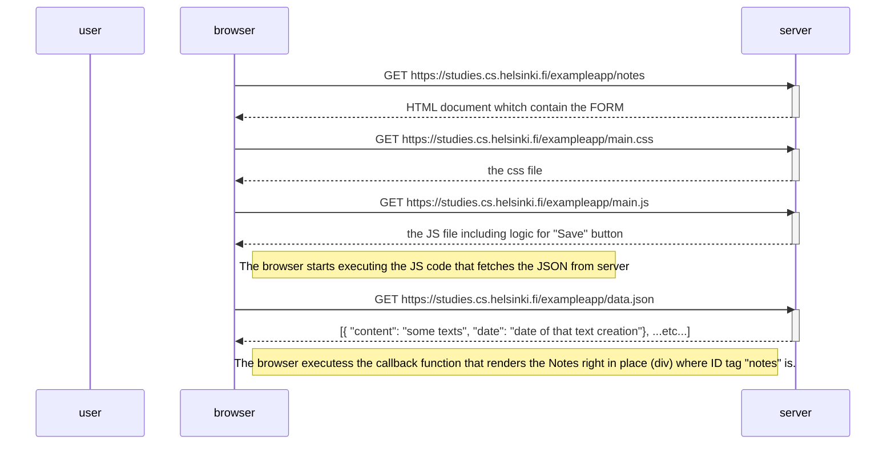

```mermaid
sequenceDiagram
    participant user
    participant browser
    participant server

    browser->>server: GET https://studies.cs.helsinki.fi/exampleapp/notes
    activate server
    server-->>browser: HTML document whitch contain the FORM
    deactivate server

    browser->>server: GET https://studies.cs.helsinki.fi/exampleapp/main.css
    activate server
    server-->>browser: the css file
    deactivate server

    browser->>server: GET https://studies.cs.helsinki.fi/exampleapp/main.js
    activate server
    server-->>browser: the JS file including logic for "Save" button
    deactivate server

Note right of browser: The browser starts executing the JS code that fetches the JSON from server

    browser->>server: GET https://studies.cs.helsinki.fi/exampleapp/data.json
    activate server
    server-->>browser: [{ "content": "some texts", "date": "date of that text creation"}, ...etc...]
    deactivate server

Note right of browser: The browser executess the callback function that renders the Notes right in place (div) where ID tag "notes" is.

```
