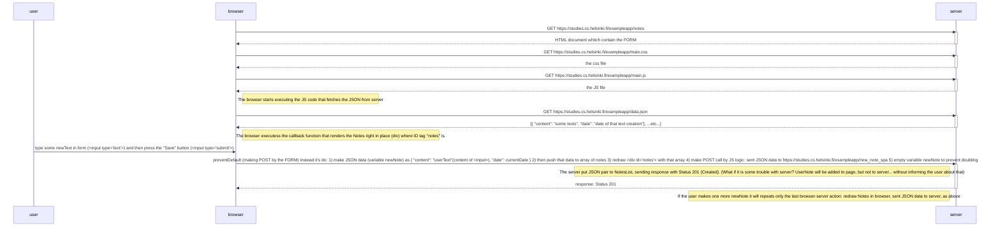

```mermaid
sequenceDiagram
    participant user
    participant browser
    participant server

    browser->>server: GET https://studies.cs.helsinki.fi/exampleapp/notes
    activate server
    server-->>browser: HTML document whitch contain the FORM
    deactivate server

    browser->>server: GET https://studies.cs.helsinki.fi/exampleapp/main.css
    activate server
    server-->>browser: the css file
    deactivate server

    browser->>server: GET https://studies.cs.helsinki.fi/exampleapp/main.js
    activate server
    server-->>browser: the JS file
    deactivate server

Note right of browser: The browser starts executing the JS code that fetches the JSON from server

    browser->>server: GET https://studies.cs.helsinki.fi/exampleapp/data.json
    activate server
    server-->>browser: [{ "content": "some texts", "date": "date of that text creation"}, ...etc...]
    deactivate server

Note right of browser: The browser executess the callback function that renders the Notes right in place (div) where ID tag "notes" is.

    user->>browser: type some newText in form (<input type="text">) and then press the "Save" button (<input type="submit">)
    browser->>server: preventDefault (making POST by the FORM) instead it's do: 1) make JSON data (variable newNote) as { "content": "userText"(content of <input>), "date": currentDate } 2) then push that data to array of notes 3) redraw <div id="notes"> with that array 4) make POST call by JS logic: sent JSON data to https://studies.cs.helsinki.fi/exampleapp/new_note_spa 5) empty variable newNote to prevent doubling
	activate server
	
Note left of server: The server put JSON pair to NotesList, sending responce with Status 201 (Created). (What if it is some trouble with server? UserNote will be added to page, but not to server... without informing the user about that)

	server-->>browser: response: Status 201
	deactivate server

Note left of server: If the user makes one more newNote it will repeats only the last browser-server action: redraw Notes in browser, sent JSON data to server, as above
```
